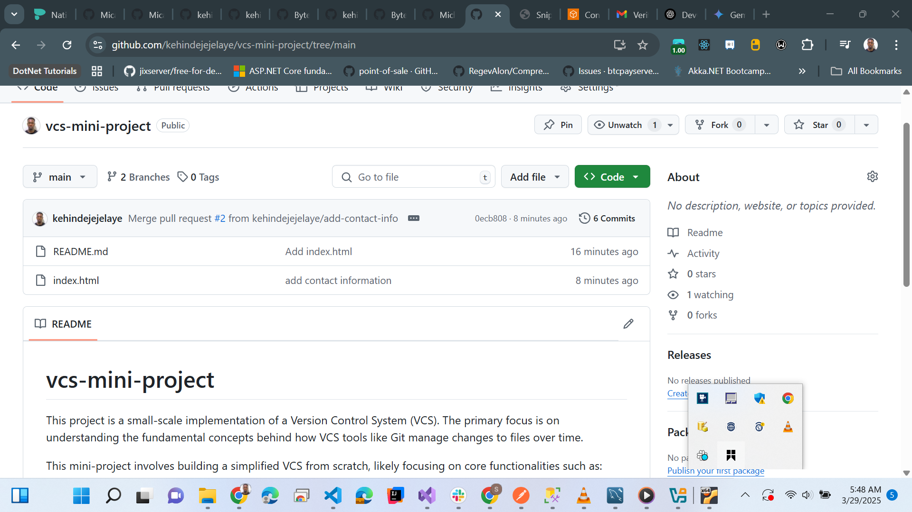
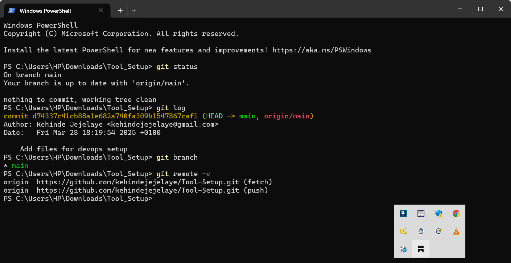

# vcs-mini-project

This project is a small-scale implementation of a Version Control System (VCS). The primary focus is on understanding the fundamental concepts behind how VCS tools like Git manage changes to files over time.

This mini-project involves building a simplified VCS from scratch, likely focusing on core functionalities such as:

* **Tracking Changes:** Recording modifications made to files.
* **Committing:** Saving snapshots of the project at specific points in time.
* **History:** Allowing users to view the evolution of their files and projects.
* **Potentially Branching and Merging (depending on complexity):** Exploring the concepts of creating parallel lines of development and integrating changes.

The goal is to gain a deeper appreciation for the inner workings of VCS by implementing a basic version ourselves, rather than solely relying on existing tools. This hands-on approach will provide valuable insights into data structures, algorithms, and design considerations involved in version control.

This project consists of an `index` file (the main entry point) and potentially other supporting files that implement the VCS logic. The `index` file will likely contain the core commands and functionalities of our mini VCS.

By the end of this project, I aim to have a functional, albeit simplified, version control system and a clearer understanding of the principles that underpin industry-standard VCS tools.

## Images

This repository includes the following images to provide visual context for the project:

### Git Dashboard

This image shows the GitHub user dashboard specifically for this `vcs-mini-project` repository. It provides an overview of the project's status on GitHub, including files, commits, and other relevant information.

### Terminal Git Commands

This image displays a terminal window demonstrating the use of Git commands. It likely showcases commands related to initializing a Git repository, adding files, making commits, or viewing the project's history. This helps illustrate the practical application of version control concepts.